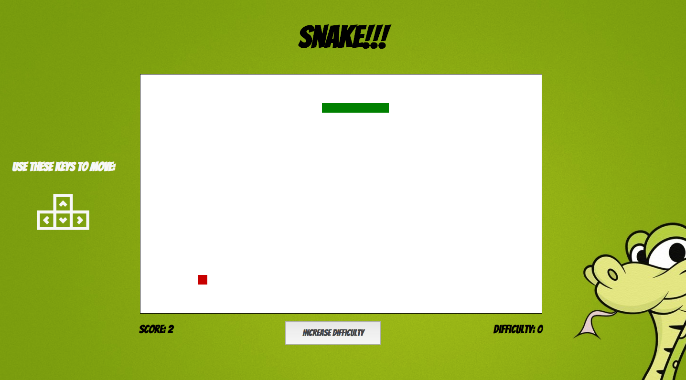

# Game Time

Game Time is an application where the user can play the classic game of Snake. The user can increase difficulty prior to starting each round. This app was built with Vanilla JavaScript and tested with Mocha and Chai.

## Getting Started:

#### Clone this repository:

`git clone https://github.com/kmiller9393/game-time.git`

#### Then:

`cd game-time`

#### Then Run:

`npm install`

#### Then Run:

`npm start`

#### To Play:

Go to where project is running in your browser, this should be http://localhost:8080/ by default.

## Overview:

